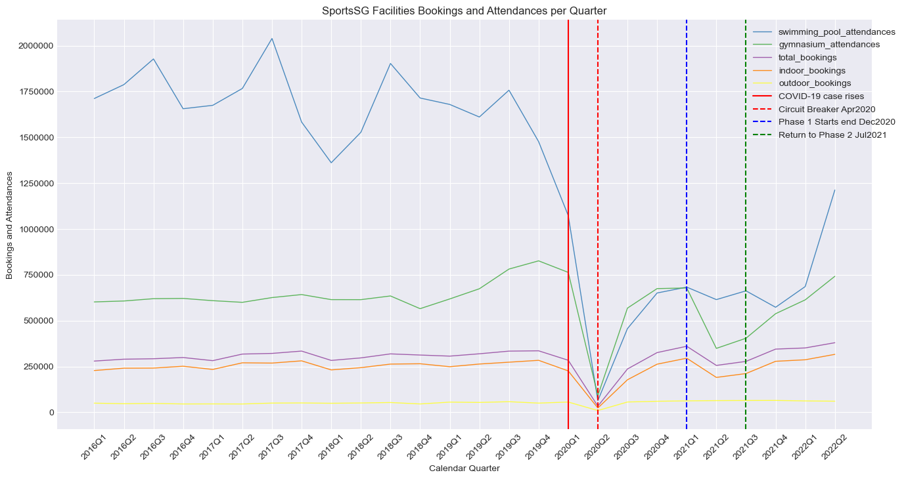

#  Project 1: Exploring Climate Data of Singapore

## Preliminary Analysis of Relationship between Rainfall and Sports Facilities Usage

### Introduction

As part of Singapore's public health strategy, the nation aims to promote better individual health and prevention through physical activity.

For that, there has been many initiatives over the years which aims to increase the physical activity level of people, such as the Great Singapore Workout and National Steps Challenge by incentivising participation.

To reduce barriers to physical activities, there are also many sport facilities managed by Sports SG which are located across the island and offer affordable rates for public use.

However, various research and studies locally and overseas have shown that weather conditions such as rainfall have a negative impact on physical activity levels.

For this project, we will analyse how rainfall in Singapore affects the utilisation of such sports facilities.

### Problem Statement

As consultants engaged by the public service, we will explore the rainfall and facilities usage data to identify trends and put forth suggestions to mitigate drops in physical activity that may result from rainy weather. 

### Datasets

#### Provided Data

There are 2 datasets included in the [`data`](./data/) folder for this project. These correspond to rainfall information. 

* [`rainfall-monthly-number-of-rain-days.csv`](./data/rainfall-monthly-number-of-rain-days.csv): Monthly number of rain days from 1982 to 2022. A day is considered to have “rained” if the total rainfall for that day is 0.2mm or more.
* [`rainfall-monthly-total.csv`](./data/rainfall-monthly-total.csv): Monthly total rain recorded in mm(millimeters) from 1982 to 2022

Other relevant weather datasets from [data.gov.sg](https://data.gov.sg/search) that you can download and use are as follows:

* [Relative Humidity](https://data.gov.sg/dataset/relative-humidity-monthly-mean)
* [Monthly Maximum Daily Rainfall](https://data.gov.sg/dataset/rainfall-monthly-maximum-daily-total)
* [Hourly wet bulb temperature](https://data.gov.sg/dataset/wet-bulb-temperature-hourly)
* [Monthly mean sunshine hours](https://data.gov.sg/dataset/sunshine-duration-monthly-mean-daily-duration)
* [Surface Air Temperature](https://data.gov.sg/dataset/surface-air-temperature-mean-daily-minimum)

**Make sure you cross-reference your data with your data sources to eliminate any data collection or data entry issues.**

#### Additional Data
You can also use other datasets for your analysis, make sure to cite the source when you are using them.

* [`formatted-sports-facility-bookings.csv`](../data/formatted-sports-facility-bookings.csv): Quarterly number of bookings and attendances of sports facilties from 2016 to 2023; sourced from [Usage of Sports Facilities Managed by Sport Singapore](https://tablebuilder.singstat.gov.sg/table/TS/M890231) via SingStat

---

### Data Dictionary

|Feature|Type|Dataset|Description|
|---|---|---|---|
|total_rainfall|float|rainfall-monthly-total|Total rainfall in mm aggregated by quarters|
|quarter|string|formatted-sports-facility-bookings|Quarter of year in yyyyQm format|
|swimming_pool_attendances|integer|formatted-sports-facility-bookings|Attendance of swimming pools in the quarter|
|gymnasium_attendances|integer|formatted-sports-facility-bookings|Attendance of gymnasiums in the quarter|
|total_bookings|integer|formatted-sports-facility-bookings|Total bookings excluding attendances in the quarter|
|badminton_bookings|integer|formatted-sports-facility-bookings|Bookings of badminton in the quarter; indoor facility|
|tennis_bookings|integer|formatted-sports-facility-bookings|Bookings of tennis in the quarter; outdoor facility|
|table-tennis_bookings|integer|formatted-sports-facility-bookings|Bookings of table tennis in the quarter; indoor facility|
|basketball_bookings|integer|formatted-sports-facility-bookings|Bookings of basketball in the quarter; indoor facility|
|squash_bookings|integer|formatted-sports-facility-bookings|Bookings of squash in the quarter; indoor facility|
|football_bookings|integer|formatted-sports-facility-bookings|Bookings of football in the quarter; outdoor facility|
|volleyball_bookings|integer|formatted-sports-facility-bookings|Bookings of volleyball in the quarter; indoor facility|
|netball_bookings|integer|formatted-sports-facility-bookings|Bookings of netball in the quarter; excluded from indoor and outdoor grouping due to mixed courts|
|hockey_bookings|integer|formatted-sports-facility-bookings|Bookings of hockey in the quarter; outdoor facility|
|rugby_bookings|integer|formatted-sports-facility-bookings|Bookings of rugby in the quarter; outdoor facility|
|athletics_bookings|integer|formatted-sports-facility-bookings|Bookings of athletics in the quarter|
|others|integer|formatted-sports-facility-bookings|Bookings of other facilities in the quarter; indoor facility|
|indoor_bookings|integer|formatted-sports-facility-bookings|Total indoor bookings in the quarter|
|outdoor_bookings|integer|formatted-sports-facility-bookings|Total outdoor bookings in the quarter|

---

### Methodology

Given the rainfall data sets and the sports facility bookings data set, we first examine the available data periods and frequency of data points. We were limited by the sports facilitiy bookings data to a quarterly data set and would need to aggregate rainfall data in quarters for analysis.

Between the two rainfall data sets, we eliminated the use of the monthly count of rainy days as based on the definition from the data set, a rainy day is counted if the daily total rainfall is at least 0.2mm. NEA also defines other thresholds, for example "heavy rainfall" at an hourly total rainfall of more than 40mm. In comparison, the definition of a rainy day, given the very low threshold set for this data set, would be a less meaningful data point as it gives little indication of the wetness of the data period, which total rainfall is a more appropriate measure for.

Based on Sports SG's definition of the data, some of the facilities have been strictly classified as indoor facilities, while the other facilities have to be classified broadly based on information available on the Sports SG and ActiveSG websites. Worth noting is there are two data points, gymasium and swimming pool facilities which have their utility record as attendances, whereas other facilities are recorded based on bookings. These two points are analysed separately.

The analysis of the facilities data has been narrowed down to the period from 2016 to 2019 to exclude data from the start of the COVID-19 pandemic, which brought along drastic changes in the data especially due to restrictions imposed by the government.

For a visualisation of the facilities data, refer to the figure below:

---

### Analysis

From our analysis, we found that there is an evident decrease in booking of outdoor facilities during periods with heavier rainfall. There is also a slight increase in booking of indoor facilities when there is an increase in rainfall. This suggests that people are less likely to book outdoor sports facilities when there are heavier rains.

As part of our research, we also found that ActiveSG also imposes a no cancellation / refund policy once a booking is confirmed, though there is a refund policy for unplayable bookings due to reasons such as rain and haze. However, the latter requires requestse to be made externally from the ActiveSG app which were used to made the bookings. 

These factors could reduce the flexibility and increases the commitment required to make these facilities bookings, but it is understandable that these policies are in place to maximise public usage.

### Limitations

Due to the limited data sets used for this project, we acknowledge and highlight some of the possible limitations.

**Time Period:** Analysis is done with limited data range over quarterly periods
- If more granular facilities data with monthly periods can be obtained, we can analyse the relationship of rainfall and facilities usage more confidently and potentially uncover different insights.

**Classification of Facilities:** Some facilities are broadly and subjectively categorised and there are some potential overlaps between indoor and outdoor facilities.

**Facility Utilisation Rates / Capacity:** There is no data point on the utilisation rate of each facility
- Utilisation rate and capacity sizes allow us to drill down into focusing on facilities that have not reached full capacity, which will allow the booking to be more responsive to other factors such as rainfall.

**Currency:** Analysis is limited to data from 2016 to 2019
- Analysis is applicable for this data period but may not be indicative of future trends, especially in the different endemic landscape and weather patterns.

---

### Conclusions and Recommendations

Our project supports that during periods of higher rainfall, the utilisation (booking and attendances) of outdoor facilities tends to be lower.

To further reduce barriers to physical activities, SportsSG / ActiveSG may consider upgrading some of their outdoor sports facilities into sheltered or indoor versions where feasible. With a sheltered equivalent of the outdoor sports facilities, people may continue to be active in their preferred outdoor activity despite heavier rainfall which will be useful to continue building a more physically active nation.

---

### Sources and References

Sources from ActiveSG on their facilities and details:
- https://members.myactivesg.com/facilities/
- https://www.activesgcircle.gov.sg/faq/

SportSG Facilities data from SingStat:
- https://tablebuilder.singstat.gov.sg/table/TS/M890231

Other information:
- https://ehjournal.biomedcentral.com/articles/10.1186/1476-069X-11-12
- https://bmcpublichealth.biomedcentral.com/articles/10.1186/s12889-022-13431-2

